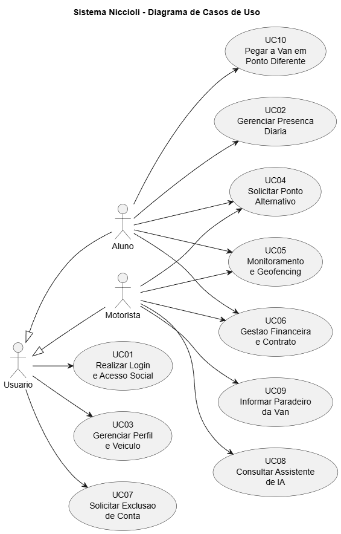

@startuml
title Sistema Niccioli - Diagrama de Casos de Uso

left to right direction

actor "Usuario" as Usuario
actor "Aluno" as Aluno
actor "Motorista" as Motorista

Usuario <|-- Aluno
Usuario <|-- Motorista

  usecase "UC01\nRealizar Login\ne Acesso Social" as UC01
  usecase "UC02\nGerenciar Presenca\nDiaria" as UC02
  usecase "UC03\nGerenciar Perfil\ne Veiculo" as UC03
  usecase "UC04\nSolicitar Ponto\nAlternativo" as UC04
  usecase "UC05\nMonitoramento\ne Geofencing" as UC05
  usecase "UC06\nGestao Financeira\ne Contrato" as UC06
  usecase "UC07\nSolicitar Exclusao\nde Conta" as UC07
  usecase "UC08\nConsultar Assistente\nde IA" as UC08
  usecase "UC09\nInformar Paradeiro\nda Van" as UC09
  usecase "UC10\nPegar a Van em\nPonto Diferente" as UC10

Usuario --> UC01
Usuario --> UC03
Usuario --> UC07

Aluno --> UC02
Aluno --> UC04
Aluno --> UC05
Aluno --> UC06
Aluno --> UC10

Motorista --> UC04
Motorista --> UC05
Motorista --> UC06
Motorista --> UC08
Motorista --> UC09

@enduml