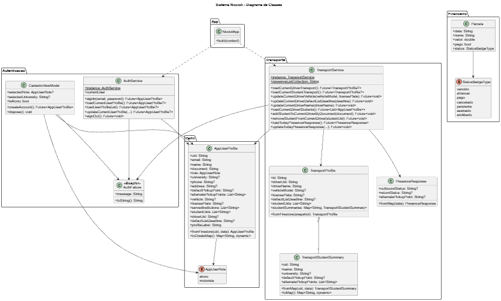

@startuml
title Sistema Niccioli - Diagrama de Classes

skinparam classAttributeIconSize 0
hide empty methods

package "App" {
  class NiccioliApp {
    +build(context)
  }
}

package "Autenticacao" {
  class AuthService {
    {static} +instance: AuthService
    +currentUser
    +signIn(email, password): Future<AppUserProfile>
    +loadCurrentUserProfile(): Future<AppUserProfile?>
    +loadUserProfile(uid): Future<AppUserProfile?>
    +updateCurrentUserProfile(...): Future<AppUserProfile?>
    +signOut(): Future<void>
  }

  class AuthFailure <<Exception>> {
    +message: String
    +toString(): String
  }

  class CadastroViewModel {
    +selectedRole: AppUserRole?
    +selectedUniversity: String?
    +isAluno: bool
    +createAccount(): Future<AppUserProfile>
    +dispose(): void
  }
}

package "Perfil" {
  enum AppUserRole {
    aluno
    motorista
  }

  class AppUserProfile {
    +uid: String
    +email: String
    +name: String
    +document: String
    +role: AppUserRole
    +university: String?
    +phone: String?
    +address: String?
    +defaultPickupPoint: String?
    +alternatePickupPoints: List<String>
    +vehicle: String?
    +licensePlate: String?
    +servedInstitutions: List<String>
    +studentUids: List<String>
    +driverUid: String?
    +defaultListDeadline: String?
    +profileLabel: String
    +fromFirestore(uid, data): AppUserProfile
    +toCreateMap(): Map<String, dynamic>
  }
}

package "Transporte" {
  class TransportService {
    {static} +instance: TransportService
    {static} +presenceListCollection: String
    +loadCurrentDriverTransport(): Future<TransportProfile?>
    +loadCurrentStudentTransport(): Future<TransportProfile?>
    +updateCurrentDriverVehicle(vehicleModel, licensePlate): Future<void>
    +updateCurrentDriverDefaultListDeadline(deadline): Future<void>
    +updateCurrentDriverName(driverName): Future<void>
    +loadCurrentDriverStudents(): Future<List<AppUserProfile>>
    +addStudentToCurrentDriverByDocument(document): Future<void>
    +removeStudentFromCurrentDriver(studentUid): Future<void>
    +loadTodayPresenceResponse(): Future<PresenceResponse>
    +updateTodayPresenceResponse(...): Future<void>
  }

  class TransportProfile {
    +id: String
    +driverUid: String
    +driverName: String
    +vehicleModel: String?
    +licensePlate: String?
    +defaultListDeadline: String?
    +studentUids: List<String>
    +studentSummaries: Map<String, TransportStudentSummary>
    +fromFirestore(snapshot): TransportProfile
  }

  class TransportStudentSummary {
    +uid: String
    +name: String
    +university: String?
    +defaultPickupPoint: String?
    +alternatePickupPoints: List<String>
    +fromMap(uid, data): TransportStudentSummary
    +toMap(): Map<String, dynamic>
  }

  class PresenceResponse {
    +outboundStatus: String?
    +returnStatus: String?
    +alternatePickupPoint: String?
    +fromMap(data): PresenceResponse
  }
}

package "Financeiro" {
  enum StatusBadgeType {
    vencido
    aVencer
    pago
    cancelado
    pendente
    assinado
    emAberto
  }

  class Parcela {
    +data: String
    +nome: String
    +valor: double
    +pago: bool
    +status: StatusBadgeType
  }
}

NiccioliApp ..> AuthService
NiccioliApp ..> TransportService

CadastroViewModel --> AppUserProfile
CadastroViewModel --> AuthFailure
CadastroViewModel --> AppUserRole

AuthService --> AppUserProfile
AuthService --> AuthFailure

AppUserProfile --> AppUserRole

TransportService --> TransportProfile
TransportService --> AppUserProfile
TransportService --> PresenceResponse
TransportService --> AuthFailure

TransportProfile "1" o-- "*" TransportStudentSummary

Parcela --> StatusBadgeType

@enduml