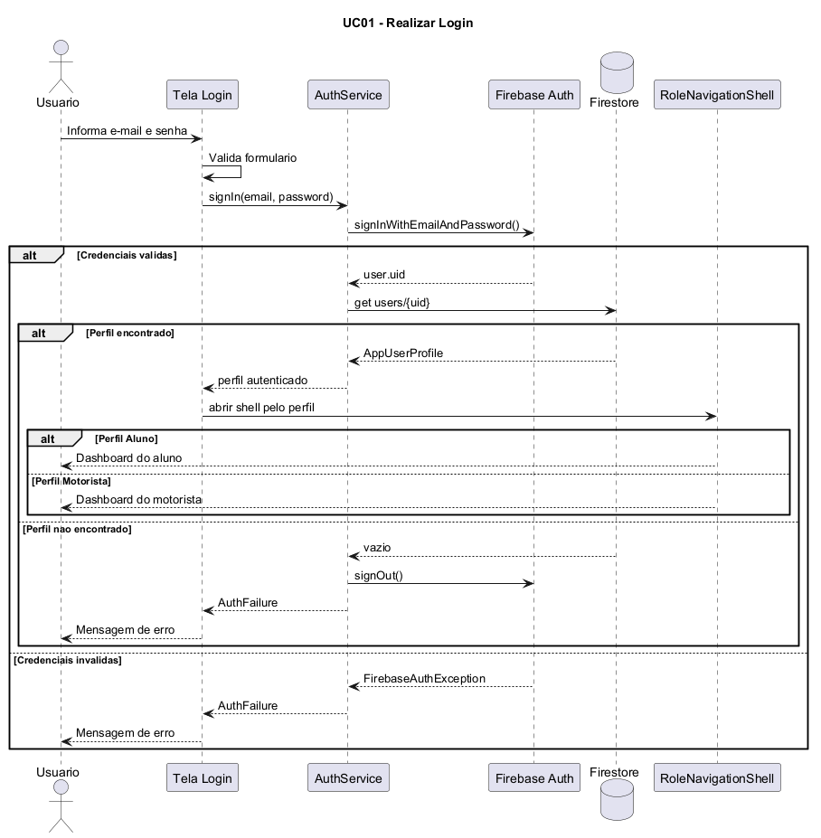
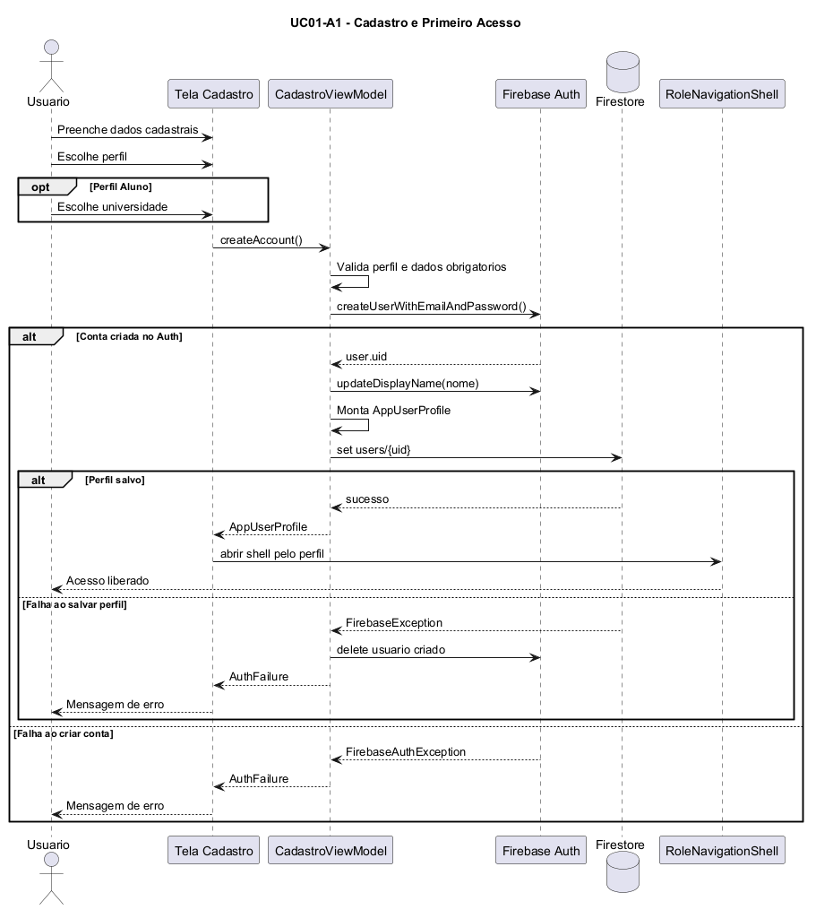
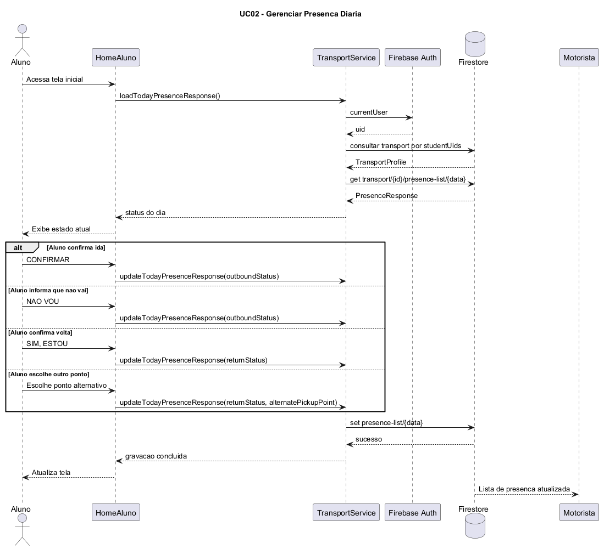
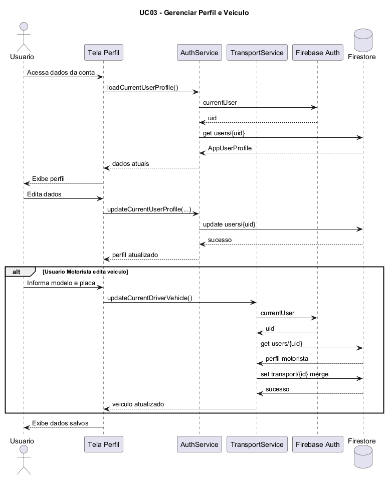
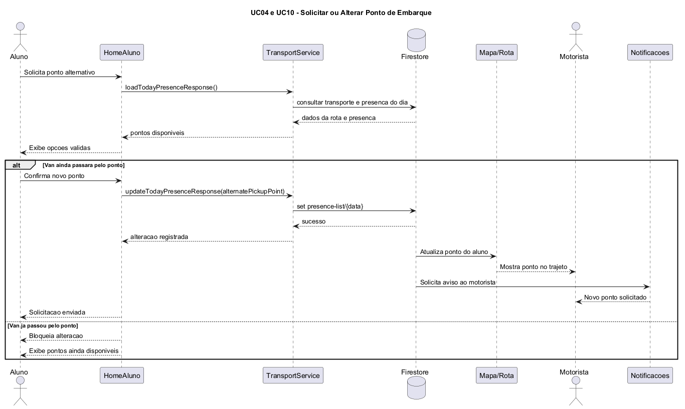
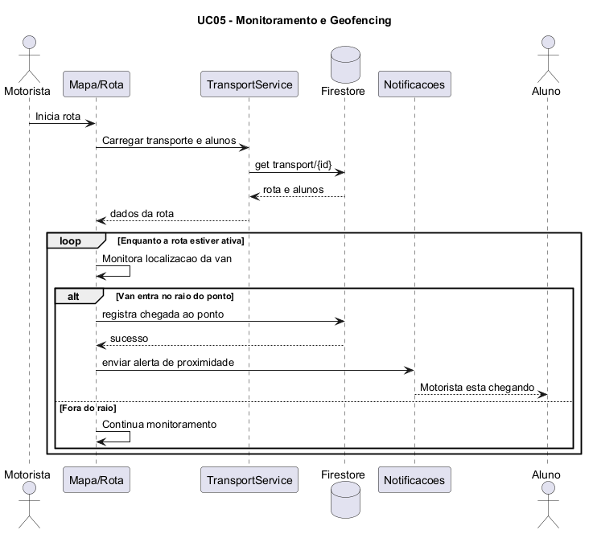
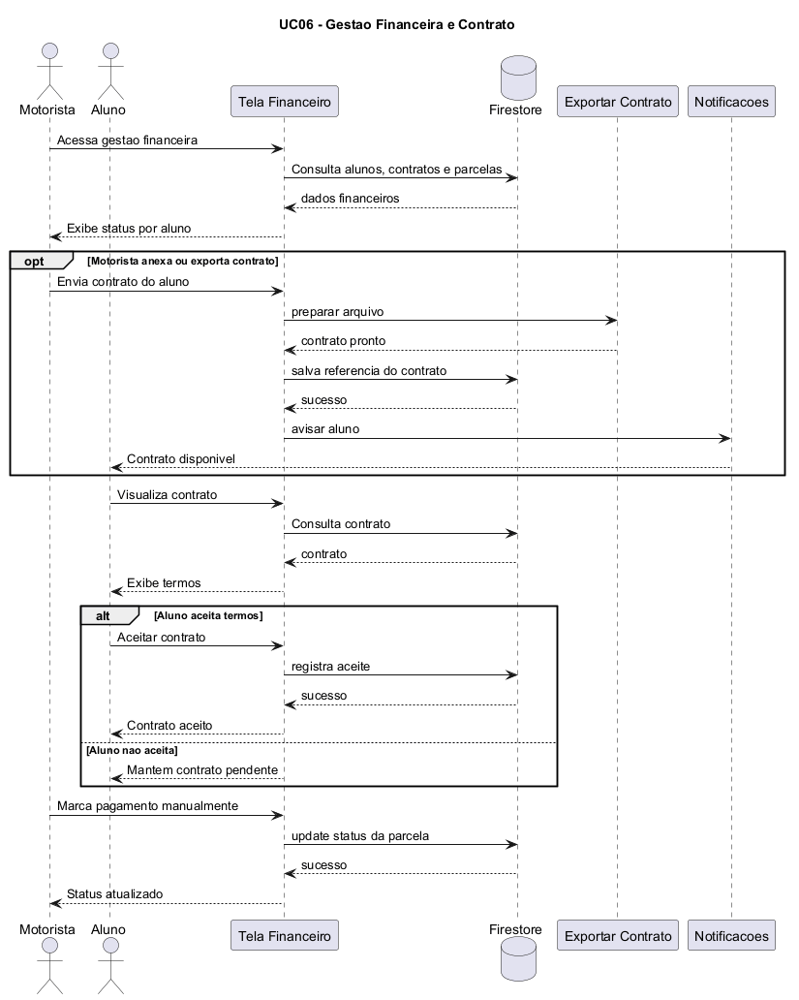
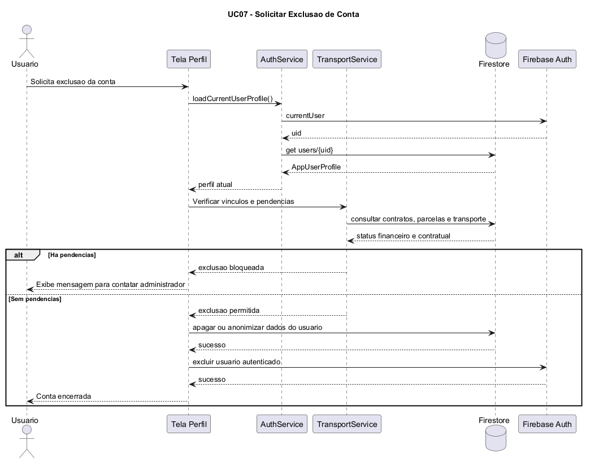
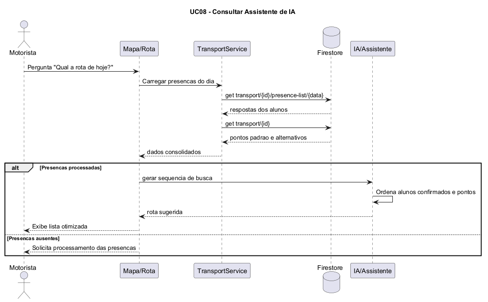
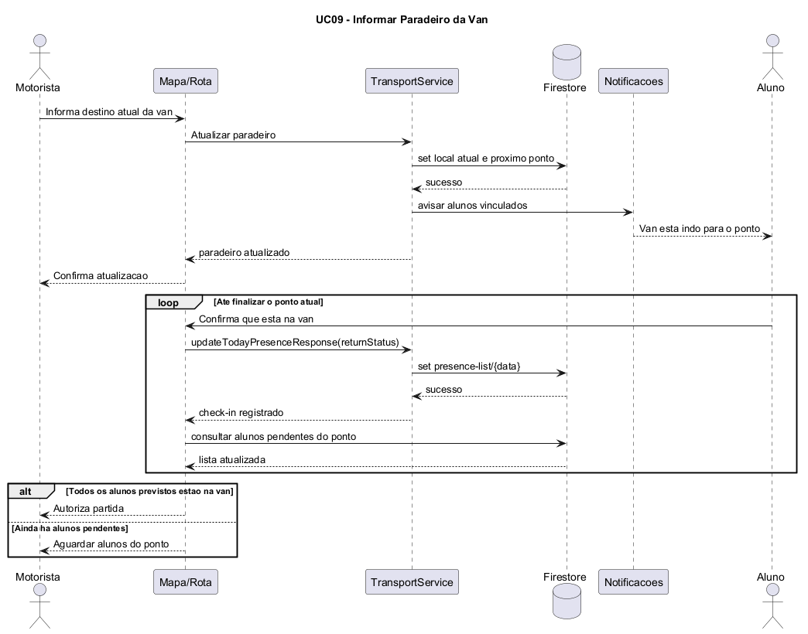

# Diagramas de Sequencia - Sistema Niccioli

Os diagramas abaixo mostram a ordem das mensagens entre os atores, telas do app Flutter, servicos internos e servicos externos usados pelo projeto, como Firebase Auth, Firestore, notificacoes e assistente de IA.

@startuml
title UC01 - Realizar Login

actor Usuario

participant "Tela Login" as Tela
participant "AuthService" as Auth
participant "Firebase Auth" as FirebaseAuth
database "Firestore" as Firestore
participant "RoleNavigationShell" as Navegacao

Usuario -> Tela : Informa e-mail e senha
Tela -> Tela : Valida formulario
Tela -> Auth : signIn(email, password)
Auth -> FirebaseAuth : signInWithEmailAndPassword()

alt Credenciais validas
    FirebaseAuth --> Auth : user.uid
    Auth -> Firestore : get users/{uid}
    alt Perfil encontrado
        Firestore --> Auth : AppUserProfile
        Auth --> Tela : perfil autenticado
        Tela -> Navegacao : abrir shell pelo perfil
        alt Perfil Aluno
            Navegacao --> Usuario : Dashboard do aluno
        else Perfil Motorista
            Navegacao --> Usuario : Dashboard do motorista
        end
    else Perfil nao encontrado
        Firestore --> Auth : vazio
        Auth -> FirebaseAuth : signOut()
        Auth --> Tela : AuthFailure
        Tela --> Usuario : Mensagem de erro
    end
else Credenciais invalidas
    FirebaseAuth --> Auth : FirebaseAuthException
    Auth --> Tela : AuthFailure
    Tela --> Usuario : Mensagem de erro
end

@enduml

@startuml
title UC01-A1 - Cadastro e Primeiro Acesso

actor Usuario

participant "Tela Cadastro" as Tela
participant "CadastroViewModel" as VM
participant "Firebase Auth" as FirebaseAuth
database "Firestore" as Firestore
participant "RoleNavigationShell" as Navegacao

Usuario -> Tela : Preenche dados cadastrais
Usuario -> Tela : Escolhe perfil

opt Perfil Aluno
    Usuario -> Tela : Escolhe universidade
end

Tela -> VM : createAccount()
VM -> VM : Valida perfil e dados obrigatorios
VM -> FirebaseAuth : createUserWithEmailAndPassword()

alt Conta criada no Auth
    FirebaseAuth --> VM : user.uid
    VM -> FirebaseAuth : updateDisplayName(nome)
    VM -> VM : Monta AppUserProfile
    VM -> Firestore : set users/{uid}
    alt Perfil salvo
        Firestore --> VM : sucesso
        VM --> Tela : AppUserProfile
        Tela -> Navegacao : abrir shell pelo perfil
        Navegacao --> Usuario : Acesso liberado
    else Falha ao salvar perfil
        Firestore --> VM : FirebaseException
        VM -> FirebaseAuth : delete usuario criado
        VM --> Tela : AuthFailure
        Tela --> Usuario : Mensagem de erro
    end
else Falha ao criar conta
    FirebaseAuth --> VM : FirebaseAuthException
    VM --> Tela : AuthFailure
    Tela --> Usuario : Mensagem de erro
end

@enduml

@startuml
title UC02 - Gerenciar Presenca Diaria

actor Aluno

participant "HomeAluno" as Home
participant "TransportService" as Transporte
participant "Firebase Auth" as FirebaseAuth
database "Firestore" as Firestore
participant "Motorista" as Motorista

Aluno -> Home : Acessa tela inicial
Home -> Transporte : loadTodayPresenceResponse()
Transporte -> FirebaseAuth : currentUser
FirebaseAuth --> Transporte : uid
Transporte -> Firestore : consultar transport por studentUids
Firestore --> Transporte : TransportProfile
Transporte -> Firestore : get transport/{id}/presence-list/{data}
Firestore --> Transporte : PresenceResponse
Transporte --> Home : status do dia
Home --> Aluno : Exibe estado atual

alt Aluno confirma ida
    Aluno -> Home : CONFIRMAR
    Home -> Transporte : updateTodayPresenceResponse(outboundStatus)
else Aluno informa que nao vai
    Aluno -> Home : NAO VOU
    Home -> Transporte : updateTodayPresenceResponse(outboundStatus)
else Aluno confirma volta
    Aluno -> Home : SIM, ESTOU
    Home -> Transporte : updateTodayPresenceResponse(returnStatus)
else Aluno escolhe outro ponto
    Aluno -> Home : Escolhe ponto alternativo
    Home -> Transporte : updateTodayPresenceResponse(returnStatus, alternatePickupPoint)
end

Transporte -> Firestore : set presence-list/{data}
Firestore --> Transporte : sucesso
Transporte --> Home : gravacao concluida
Home --> Aluno : Atualiza tela
Firestore --> Motorista : Lista de presenca atualizada

@enduml

@startuml
title UC03 - Gerenciar Perfil e Veiculo

actor Usuario

participant "Tela Perfil" as Tela
participant "AuthService" as Auth
participant "TransportService" as Transporte
participant "Firebase Auth" as FirebaseAuth
database "Firestore" as Firestore

Usuario -> Tela : Acessa dados da conta
Tela -> Auth : loadCurrentUserProfile()
Auth -> FirebaseAuth : currentUser
FirebaseAuth --> Auth : uid
Auth -> Firestore : get users/{uid}
Firestore --> Auth : AppUserProfile
Auth --> Tela : dados atuais
Tela --> Usuario : Exibe perfil

Usuario -> Tela : Edita dados
Tela -> Auth : updateCurrentUserProfile(...)
Auth -> Firestore : update users/{uid}
Firestore --> Auth : sucesso
Auth --> Tela : perfil atualizado

alt Usuario Motorista edita veiculo
    Usuario -> Tela : Informa modelo e placa
    Tela -> Transporte : updateCurrentDriverVehicle()
    Transporte -> FirebaseAuth : currentUser
    FirebaseAuth --> Transporte : uid
    Transporte -> Firestore : get users/{uid}
    Firestore --> Transporte : perfil motorista
    Transporte -> Firestore : set transport/{id} merge
    Firestore --> Transporte : sucesso
    Transporte --> Tela : veiculo atualizado
end

Tela --> Usuario : Exibe dados salvos

@enduml

@startuml
title UC04 e UC10 - Solicitar ou Alterar Ponto de Embarque

actor Aluno

participant "HomeAluno" as Home
participant "TransportService" as Transporte
database "Firestore" as Firestore
participant "Mapa/Rota" as Mapa
actor Motorista
participant "Notificacoes" as Notificacoes

Aluno -> Home : Solicita ponto alternativo
Home -> Transporte : loadTodayPresenceResponse()
Transporte -> Firestore : consultar transporte e presenca do dia
Firestore --> Transporte : dados da rota e presenca
Transporte --> Home : pontos disponiveis
Home --> Aluno : Exibe opcoes validas

alt Van ainda passara pelo ponto
    Aluno -> Home : Confirma novo ponto
    Home -> Transporte : updateTodayPresenceResponse(alternatePickupPoint)
    Transporte -> Firestore : set presence-list/{data}
    Firestore --> Transporte : sucesso
    Transporte --> Home : alteracao registrada
    Firestore -> Mapa : Atualiza ponto do aluno
    Mapa --> Motorista : Mostra ponto no trajeto
    Firestore -> Notificacoes : Solicita aviso ao motorista
    Notificacoes --> Motorista : Novo ponto solicitado
    Home --> Aluno : Solicitacao enviada
else Van ja passou pelo ponto
    Home --> Aluno : Bloqueia alteracao
    Home --> Aluno : Exibe pontos ainda disponiveis
end

@enduml

@startuml
title UC05 - Monitoramento e Geofencing

actor Motorista

participant "Mapa/Rota" as Mapa
participant "TransportService" as Transporte
database "Firestore" as Firestore
participant "Notificacoes" as Notificacoes
actor Aluno

Motorista -> Mapa : Inicia rota
Mapa -> Transporte : Carregar transporte e alunos
Transporte -> Firestore : get transport/{id}
Firestore --> Transporte : rota e alunos
Transporte --> Mapa : dados da rota

loop Enquanto a rota estiver ativa
    Mapa -> Mapa : Monitora localizacao da van
    alt Van entra no raio do ponto
        Mapa -> Firestore : registra chegada ao ponto
        Firestore --> Mapa : sucesso
        Mapa -> Notificacoes : enviar alerta de proximidade
        Notificacoes --> Aluno : Motorista esta chegando
    else Fora do raio
        Mapa -> Mapa : Continua monitoramento
    end
end

@enduml

@startuml
title UC06 - Gestao Financeira e Contrato

actor Motorista
actor Aluno

participant "Tela Financeiro" as Financeiro
database "Firestore" as Firestore
participant "Exportar Contrato" as Contrato
participant "Notificacoes" as Notificacoes

Motorista -> Financeiro : Acessa gestao financeira
Financeiro -> Firestore : Consulta alunos, contratos e parcelas
Firestore --> Financeiro : dados financeiros
Financeiro --> Motorista : Exibe status por aluno

opt Motorista anexa ou exporta contrato
    Motorista -> Financeiro : Envia contrato do aluno
    Financeiro -> Contrato : preparar arquivo
    Contrato --> Financeiro : contrato pronto
    Financeiro -> Firestore : salva referencia do contrato
    Firestore --> Financeiro : sucesso
    Financeiro -> Notificacoes : avisar aluno
    Notificacoes --> Aluno : Contrato disponivel
end

Aluno -> Financeiro : Visualiza contrato
Financeiro -> Firestore : Consulta contrato
Firestore --> Financeiro : contrato
Financeiro --> Aluno : Exibe termos

alt Aluno aceita termos
    Aluno -> Financeiro : Aceitar contrato
    Financeiro -> Firestore : registra aceite
    Firestore --> Financeiro : sucesso
    Financeiro --> Aluno : Contrato aceito
else Aluno nao aceita
    Financeiro --> Aluno : Mantem contrato pendente
end

Motorista -> Financeiro : Marca pagamento manualmente
Financeiro -> Firestore : update status da parcela
Firestore --> Financeiro : sucesso
Financeiro --> Motorista : Status atualizado

@enduml

@startuml
title UC07 - Solicitar Exclusao de Conta

actor Usuario

participant "Tela Perfil" as Tela
participant "AuthService" as Auth
participant "TransportService" as Transporte
database "Firestore" as Firestore
participant "Firebase Auth" as FirebaseAuth

Usuario -> Tela : Solicita exclusao da conta
Tela -> Auth : loadCurrentUserProfile()
Auth -> FirebaseAuth : currentUser
FirebaseAuth --> Auth : uid
Auth -> Firestore : get users/{uid}
Firestore --> Auth : AppUserProfile
Auth --> Tela : perfil atual

Tela -> Transporte : Verificar vinculos e pendencias
Transporte -> Firestore : consultar contratos, parcelas e transporte
Firestore --> Transporte : status financeiro e contratual

alt Ha pendencias
    Transporte --> Tela : exclusao bloqueada
    Tela --> Usuario : Exibe mensagem para contatar administrador
else Sem pendencias
    Transporte --> Tela : exclusao permitida
    Tela -> Firestore : apagar ou anonimizar dados do usuario
    Firestore --> Tela : sucesso
    Tela -> FirebaseAuth : excluir usuario autenticado
    FirebaseAuth --> Tela : sucesso
    Tela --> Usuario : Conta encerrada
end

@enduml

@startuml
title UC08 - Consultar Assistente de IA

actor Motorista

participant "Mapa/Rota" as Mapa
participant "TransportService" as Transporte
database "Firestore" as Firestore
participant "IA/Assistente" as IA

Motorista -> Mapa : Pergunta "Qual a rota de hoje?"
Mapa -> Transporte : Carregar presencas do dia
Transporte -> Firestore : get transport/{id}/presence-list/{data}
Firestore --> Transporte : respostas dos alunos
Transporte -> Firestore : get transport/{id}
Firestore --> Transporte : pontos padrao e alternativos
Transporte --> Mapa : dados consolidados

alt Presencas processadas
    Mapa -> IA : gerar sequencia de busca
    IA -> IA : Ordena alunos confirmados e pontos
    IA --> Mapa : rota sugerida
    Mapa --> Motorista : Exibe lista otimizada
else Presencas ausentes
    Mapa --> Motorista : Solicita processamento das presencas
end

@enduml

@startuml
title UC09 - Informar Paradeiro da Van

actor Motorista

participant "Mapa/Rota" as Mapa
participant "TransportService" as Transporte
database "Firestore" as Firestore
participant "Notificacoes" as Notificacoes
actor Aluno

Motorista -> Mapa : Informa destino atual da van
Mapa -> Transporte : Atualizar paradeiro
Transporte -> Firestore : set local atual e proximo ponto
Firestore --> Transporte : sucesso
Transporte -> Notificacoes : avisar alunos vinculados
Notificacoes --> Aluno : Van esta indo para o ponto
Transporte --> Mapa : paradeiro atualizado
Mapa --> Motorista : Confirma atualizacao

loop Ate finalizar o ponto atual
    Aluno -> Mapa : Confirma que esta na van
    Mapa -> Transporte : updateTodayPresenceResponse(returnStatus)
    Transporte -> Firestore : set presence-list/{data}
    Firestore --> Transporte : sucesso
    Transporte --> Mapa : check-in registrado
    Mapa -> Firestore : consultar alunos pendentes do ponto
    Firestore --> Mapa : lista atualizada
end

alt Todos os alunos previstos estao na van
    Mapa --> Motorista : Autoriza partida
else Ainda ha alunos pendentes
    Mapa --> Motorista : Aguardar alunos do ponto
end

@enduml

